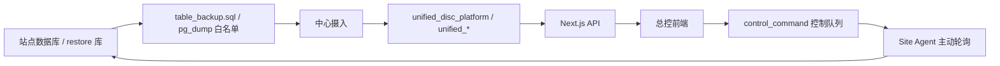

# 统一光盘库总控平台

集团层统一管控平台。总控不替代站点原系统，目标是把多站点数据库同步到中心库，并在总控完成查看、检索、导出、同步、任务控制和审计。

## 当前口径

- 最高验收标准: `docs/source/requirements.md`
- 项目约束: `CLAUDE.md` + `AGENTS.md`
- 严格完成率: `29/45 = 64.4%`
- 候选实现覆盖: `45/45 candidate`，但未接入真实 ADFS/LDAP、ES/ClickHouse 生产环境和全部站点生产 Agent 前，不能按 strict complete 汇报。
- 产品页面读取中心拥有的数据: `unified_*`、中心审计/同步表、ES/OpenSearch、ClickHouse；源库/restore 库只作为同步来源。

禁止把 mock、simulator、DRY_RUN 或 blocked 边界说成真实完成。

## 已实现主链路



核心能力:

- 同步: 13 张白名单表 dump 摄入中心库，支持手动触发和 Site Agent 同步。
- 查看: 首页、任务、盘架、卷、站点、用户、日志、设置、检索均接真实 API 或显式 blocked 状态。
- 控制: 总控创建任务、暂停、恢复等命令进入 `control_command`，由 Site Agent 拉取执行。
- 导出: 任务/设备/卷/日志/用户/检索/同步日志等导出带记录数和 SHA-256 摘要。
- 安全: local JWT + RBAC 基础、登录审计、导出审计、hash chain 审计验证、未登录 401。
- UI/UX: Command Center 首页、全局命令面板、全页面首访引导、统一时间格式、真实/blocked 口径提示。

## 仍需外部条件

| 项 | 当前状态 | 需要什么 |
|---|---|---|
| ADFS / LDAP / 企业 SSO | `blocked_by_auth` | 领导/运维提供 ADFS/OIDC/LDAP 参数、回调地址、测试账号 |
| ES / OpenSearch | `blocked_by_external_system` | 部署地址、索引策略、文件索引写入验证 |
| ClickHouse | `partial` | 部署地址、日志表结构、保留策略 |
| 部分站点 schema | `blocked_by_source_schema` | 站点表字段/控制表补齐 |
| 生产 Site Agent | `blocked_by_site_change` | 站点部署 Agent、密钥和 systemd/进程守护 |

## 技术栈

| 类别 | 技术 |
|---|---|
| Framework | Next.js 16 + React 19 |
| Language | TypeScript |
| UI | Tailwind CSS v4 + Radix UI + Lucide |
| Database | PostgreSQL 17 |
| Sync | pg_dump `table_backup.sql` + Site Agent |
| Auth | local JWT / RBAC 基础，ADFS/OIDC/LDAP 为候选边界 |
| Search/Logs | ES/OpenSearch、ClickHouse repository 边界 |

## 快速启动

```bash
pnpm install
cp .env.example .env.local
pnpm db:up
pnpm dev
```

访问: `http://localhost:3000`

本地测试账号来自中心库 seed/auth 初始化:

| 账号 | 密码 | 角色 |
|---|---|---|
| `admin` | `admin` | group_admin |

生产或汇报环境必须替换 `.env.local` 中的密钥、数据库 URL 和 Agent secret。不要提交 `.env.local`。

## 常用环境变量

只提交 key ref，不提交真实 secret。

| 变量 | 说明 |
|---|---|
| `DATABASE_URL` | 中心库 `unified_disc_platform` |
| `SOURCE_DATABASE_URL` / `SITE_DATABASE_URL` | 测试站点库/restore 库 |
| `JWT_SECRET` | local JWT 签名密钥 |
| `SITE_AGENT_SECRET` / `SYNC_PACKAGE_SECRET` | Site Agent HMAC |
| `SEARCH_ES_URL` | ES/OpenSearch，可空；空时返回 blocked |
| `CLICKHOUSE_URL` | ClickHouse，可空；空时走中心 PG/blocked |

## 验证命令

提交前至少运行:

```bash
set -a && source .env.local && set +a
pnpm exec tsc --noEmit
pnpm build
pnpm smoke:sync
pnpm check:sync-consistency -- --siteCode=SH01
pnpm baseline:check
pnpm e2e:all
```

R.55-R.68 相关定向验证:

```bash
pnpm e2e:sync-dump-parser
pnpm e2e:sync-dump
pnpm e2e:search-es
pnpm e2e:clickhouse-logs
pnpm e2e:task-create-control
pnpm e2e:worst-case
```

注意:

- `e2e:search-es` 在 `SEARCH_ES_URL` 未配置时只证明 blocked 边界正确。
- `e2e:clickhouse-logs` 在 `CLICKHOUSE_URL` 未配置时只证明 ClickHouse 边界/中心 PG 回退正确。
- `baseline:check` 需要先加载 `.env.local`。

## 目录说明

```text
app/                     Next.js 页面和 API routes
components/              UI、Dashboard、任务控制、共享组件
lib/                     DB、同步、控制、认证、ES/CH repository
scripts/e2e/             白盒/接口/事件级 e2e
scripts/sync/            dump 导出与摄入工具
scripts/site-agent/      站点 Agent 入口
databases/sprint-*/      schema patch 和数据库脚本
docs/source/             requirements.md 等最高需求来源
docs/database-analysis/  requirements review、矩阵、审计
docs/superpowers/plans/  规划文档
deploy/                  部署模板
```

## 安全边界

- `.env.local`、真实数据库密码、真实密钥不提交。
- `.env.example` 只能写变量名和空占位。
- 大表 `tbl_file` / `tbl_folder` 不全量进入 PG17，走 ES/ClickHouse 边界。
- UI 不显示假成功；控制类操作必须使用“已提交到控制队列，等待站点 Agent 执行”口径。
- 产品页面不能直接读 restore/source 库；restore/source 只用于同步来源和测试。

## 汇报口径

可以说:

> 总控主链路已经完成候选实现并通过本地验证：中心库统一读取、pg_dump 白名单同步、Site Agent 轮询执行、总控创建任务写入站点库、导出审计、安全边界和全量 e2e 均已跑通。严格 requirements 当前 29/45，剩余主要依赖 ADFS/LDAP、ES/ClickHouse 正式环境、站点 schema 和生产 Agent 部署验证。

不要说:

- “45/45 已完成”
- “ES/ClickHouse 已生产接入”
- “ADFS/LDAP 已完成”
- “控制已真实成功”但没有站点 Agent 执行和站点库回写证据
