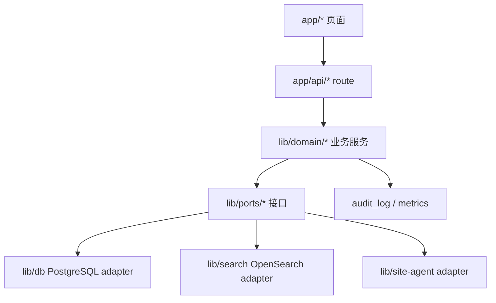

# 架构质量路线图

本文把后续开发约束落到可执行架构。参考课程笔记中的架构描述、质量属性场景、关注点分离、信息隐藏、低耦合高内聚、SOLID、KISS/YAGNI 和架构评估方法。

## 1. 架构目标

- 统一视图和检索可扩展到多站点。
- 中心库承担业务元数据，不承担大表全文搜索。
- 站点 Agent 与中心服务松耦合，站点断连时可恢复。
- 所有外部依赖有明确边界、状态和降级语义。
- README 干净，复杂计划进入 docs。

## 2. 分层边界



目标边界:

| 层 | 职责 | 禁止 |
|---|---|---|
| UI | 展示状态、触发 API、准确 toast | 直接拼 SQL、直接读 env |
| API | 鉴权、输入校验、HTTP envelope | 写复杂同步逻辑 |
| Domain | 业务规则、状态机、事务边界 | 依赖具体数据库驱动 |
| Ports | 抽象外部能力 | 泄露实现细节 |
| Adapters | PG/ES/Agent/ClickHouse 实现 | 改变业务语义 |

## 3. 质量属性场景

| 属性 | 刺激 | 响应 | 度量 |
|---|---|---|---|
| 性能 | 20 个并发用户查询任务/设备 | API 从中心库分页返回 | 普通查询 P95 ≤ 1s |
| 搜索性能 | 用户搜索千万级文件索引 | API 查 ES 并权限过滤 | 复杂检索 P95 ≤ 2s |
| 可用性 | 站点 Agent 断连 | 中心显示 offline，任务进入队列等待拉取 | 主页面可用，状态不误导 |
| 安全性 | 未授权用户跨站点访问 | API 返回 401/403 | 0 条越权数据 |
| 可修改性 | 新增一个站点源表 | 只新增 mapper/dispatcher/test | 不改 UI 通用组件 |
| 可测试性 | 新增一个同步路径 | 单测 + e2e + strict review | CI 可重复验证 |
| 可维护性 | README/计划更新 | README 保持入口化，细节在 docs | README < 200 行 |

## 4. 设计规则

1. 领域规则不写进页面组件。
2. API route 只做鉴权、校验、调用 service、返回 envelope。
3. 每个外部系统必须有 adapter 和 blocked 状态。
4. 大表搜索走 ES adapter，不走 PG 全量。
5. 站点控制只说“命令已提交到控制队列”，除非有站点执行和回写证据。
6. 新增数据源必须同步更新 requirements review。
7. 生成物不提交，例如 `audit/*.json`。

## 5. 异味检查表

| 异味 | 本项目表现 | 处理 |
|---|---|---|
| 僵化 | 新增表要改多个散落文件 | 建 mapper registry 和 dispatcher contract |
| 脆弱 | 文档说完成但测试/DB 不支持 | 以 live code + DB + tests 为准 |
| 固化 | 搜索逻辑绑死 PG | 抽 `SearchPort`，ES 是 adapter |
| 粘滞 | 正确部署路径太长 | README 只留最短路径，部署手册给完整路径 |
| 晦涩 | README 混历史和操作 | 历史进 database-analysis，入口文档瘦身 |
| 无谓复杂 | 先做多套搜索引擎 | 只落 OpenSearch/ES 一条路径 |
| 重复 | API CRUD route 重复鉴权 | 共用 `guardR83Api`，后续抽 route factory |

## 6. 目标目录

```text
lib/
  domain/
    sync/
    search/
    control/
  ports/
    search-port.ts
    site-agent-port.ts
  adapters/
    postgres/
    opensearch/
    site-agent/
```

当前仓库还没有完全迁移到该形态。后续 Sprint 应小步迁移，避免一次性大重构。

## 7. 评估方式

- 每个 Sprint 做 requirements review。
- 每个架构变更列出质量属性场景。
- 每个外部依赖必须有失败态测试。
- PR 合并前最少跑:

```bash
pnpm exec tsc --noEmit
pnpm build
pnpm smoke:sync
pnpm baseline:check
pnpm audit:center-db -- --strict --matrix
```
