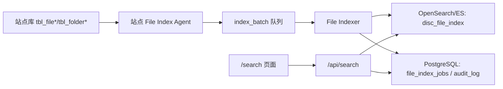

# 大表与 OpenSearch/ES 规划

## 1. 为什么大表不进 PG 全量

`tbl_file*` / `tbl_folder*` 属于文件索引与目录树数据，单站点可能达到千万级，多站点汇总后会把 PostgreSQL 中心库变成重型搜索库。这样会破坏:

- 性能: 普通业务查询和文件模糊检索互相拖慢。
- 可维护性: 同步、检索、导出耦合在一个数据库里。
- 可用性: 大批量索引写入可能影响中心库交易写入。
- 安全性: 文件路径、部门、任务信息必须独立权限过滤和审计。

结论: PG 只保存业务元数据和索引任务状态；文件明细进入 OpenSearch/ES。

## 2. 架构边界



边界:

- `File Index Agent`: 只读站点库，分页抽取，生成索引事件。
- `File Indexer`: 执行批量 upsert，负责重试、死信、指标。
- `Search API`: 做权限过滤、站点过滤、查询 ES，不直连站点库。
- PostgreSQL: 保存任务、状态、审计，不保存千万级文件明细。

## 3. 索引字段

最小可用字段:

| 字段 | 类型 | 说明 |
|---|---|---|
| `source_site_id` | keyword | 站点 |
| `source_record_id` | keyword | 源表主键 |
| `file_name` | text + keyword | 文件名检索与精确过滤 |
| `file_path` | text | 路径检索 |
| `folder_path` | text | 目录检索 |
| `extension` | keyword | 后缀过滤 |
| `size_bytes` | long | 大小过滤和统计 |
| `volume_code` | keyword | 存储卷 |
| `disc_code` | keyword | 光盘编号 |
| `department_id` | keyword | 部门权限过滤 |
| `task_id` | keyword | 任务关联 |
| `updated_at` | date | 增量水位 |
| `deleted` | boolean | 软删除 |

## 4. 质量属性场景

| 属性 | 场景 | 响应度量 |
|---|---|---|
| 性能 | 用户按文件名跨站点检索 | P95 ≤ 2s，结果分页返回 |
| 可用性 | ES 暂时不可用 | API 返回 `blocked_by_external_system`，PG 主业务不受影响 |
| 可修改性 | 新增一个文件字段 | 只改 index mapping + mapper + API DTO，不改同步主链路 |
| 安全性 | 用户跨站点搜索 | API 强制 `siteCode` / 部门过滤，禁止未授权结果 |
| 可测试性 | 新增索引批次处理 | 有 mapper 单测、indexer dry-run、ES e2e |

## 5. 分阶段计划

### R.84: 源表分类和契约

- **完成**: 决策矩阵落地, 见 [R.84 source table classification](../../database-analysis/r84-source-table-classification.md)。
- 输出 29 张 `tbl_file*` / `tbl_folder*` 清单 (`file_index_es` 类别)。
- 141 张白名单走 `pg_unified` (R.83 dispatcher 已完成)。
- 定义 `FileIndexDocument`、mapping、权限过滤字段 (R.85 创建 `lib/domain/search/file-index-document.ts`)。
- 补 `docs/database-analysis/sprint-r84-requirements-review.md`。

**R.84 状态**: `complete` (170/170 全表归类, `needs_decision=0`)。
**needs_decision 状态门**: 若任意一张表未分类, R.85 阻塞。

验收:

```bash
pnpm audit:classify-source-tables
# classified=170 needs_decision=0
pnpm audit:center-db -- --strict --matrix
pnpm e2e:search
```

### R.85: 本地 OpenSearch 索引最小闭环

- 增加 `scripts/index/file-indexer.ts`。
- 支持从测试源读取 1000 条以内样本写入 ES。
- `/api/search` 对 ES 不可用时返回明确 blocked 状态。

验收:

```bash
pnpm e2e:search-es
pnpm build
```

### R.86: 增量与删除

- 加水位表 `file_index_jobs`。
- 支持 `updated_at` 或主键窗口增量。
- 支持软删除 tombstone。

验收:

```bash
pnpm e2e:search-es
pnpm baseline:check
```

### R.87: 生产化

- 批量大小、重试、死信、指标、告警。
- 权限过滤与导出审计。
- 索引重建 runbook。

验收:

```bash
pnpm e2e:all
docker build -t unified-disc-platform:release-check .
```

## 6. 禁止做法

- 不把 `tbl_file*` / `tbl_folder*` 全量写入 PG `unified_*`。
- 不绕过权限直接查 ES。
- 不把 ES 检索成功说成文件导出或任务控制完成。
- 不在中心服务保存站点数据库明文密码。
