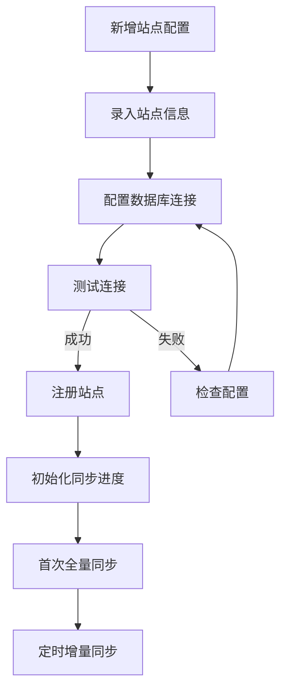

# 多站点 ID 策略

> 文档版本: v1.0
> 更新时间: 2026-05-28

---

## 一、问题背景

### 1.1 ID 冲突问题

多站点数据库同步时，不同站点的原始 ID 会产生冲突：

| 站点 | tbl_task.id | tbl_disc_lib.lib_id |
|------|-------------|---------------------|
| 站点 A | 1, 2, 3... | 1, 2, 3... |
| 站点 B | 1, 2, 3... | 1, 2, 3... |
| 站点 C | 1, 2, 3... | 1, 2, 3... |

如果直接合并到统一平台，ID 冲突将导致数据覆盖或插入失败。

### 1.2 解决目标

```
┌─────────────────────────────────────────────────────────────┐
│                       解决目标                              │
├─────────────────────────────────────────────────────────────┤
│  1. 保留原始 ID，便于溯源和回查                              │
│  2. 支持多站点数据合并，无冲突                               │
│  3. 关联查询可正常执行（任务 ↔ 设备 ↔ 站点）                 │
│  4. 索引效率不受影响                                         │
└─────────────────────────────────────────────────────────────┘
```

---

## 二、解决方案

### 2.1 推荐方案：复合主键 + 统一 ID

**核心思想**：保留原始 ID 作为溯源依据，生成统一 ID 作为主键。

```sql
-- 统一平台中心库表结构
CREATE TABLE unified_tasks (
    -- 统一 ID（主键）
    id BIGSERIAL PRIMARY KEY,

    -- 原始 ID 信息（溯源用）
    source_site_id VARCHAR(50) NOT NULL,    -- 来源站点 ID
    source_table VARCHAR(100) NOT NULL,     -- 来源表名
    source_id BIGINT NOT NULL,              -- 原始主键值

    -- 业务字段
    task_name VARCHAR(255),
    task_type INT,
    status INT,
    burn_status INT,
    total_files BIGINT,
    total_size BIGINT,

    -- 元数据
    create_dt TIMESTAMP,
    update_dt TIMESTAMP,
    synced_at TIMESTAMP DEFAULT CURRENT_TIMESTAMP,

    -- 唯一约束（防止重复同步）
    UNIQUE(source_site_id, source_table, source_id)
);

-- 索引
CREATE INDEX idx_unified_tasks_site ON unified_tasks(source_site_id);
CREATE INDEX idx_unified_tasks_status ON unified_tasks(status);
CREATE INDEX idx_unified_tasks_update ON unified_tasks(update_dt);
```

### 2.2 同步示例

**站点 A 同步任务**

| 字段 | 值 |
|------|-----|
| id | 1 (自增) |
| source_site_id | 'site_a' |
| source_table | 'tbl_task' |
| source_id | 1001 (原始ID) |
| task_name | '备份任务-1' |

**站点 B 同步任务**

| 字段 | 值 |
|------|-----|
| id | 2 (自增) |
| source_site_id | 'site_b' |
| source_table | 'tbl_task' |
| source_id | 1001 (原始ID) |
| task_name | '归档任务-1' |

两条记录共存，因为 `(source_site_id, source_table, source_id)` 组合唯一。

---

## 三、ID 映射表

### 3.1 映射表设计

当需要回写到源站点时，需要 ID 映射表：

```sql
-- ID 映射表（可选，用于回写场景）
CREATE TABLE id_mapping (
    id SERIAL PRIMARY KEY,

    -- 映射标识
    source_site_id VARCHAR(50) NOT NULL,
    source_table VARCHAR(100) NOT NULL,

    -- ID 映射
    unified_id BIGINT NOT NULL,            -- 统一平台 ID
    source_id BIGINT NOT NULL,              -- 原始 ID

    -- 时间戳
    created_at TIMESTAMP DEFAULT CURRENT_TIMESTAMP,

    UNIQUE(source_site_id, source_table, source_id)
);

-- 索引
CREATE INDEX idx_mapping_unified ON id_mapping(unified_id);
CREATE INDEX idx_mapping_source ON id_mapping(source_site_id, source_table, source_id);
```

### 3.2 映射表用途

| 场景 | 用途 |
|------|------|
| 数据回写 | 将统一平台的操作同步回源站点 |
| 关联查询 | 通过映射表关联查询原始记录 |
| 数据溯源 | 追溯数据来源和原始 ID |

---

## 四、站点 ID 管理

### 4.1 站点配置表

```sql
CREATE TABLE sync_sites (
    id SERIAL PRIMARY KEY,
    site_id VARCHAR(50) NOT NULL UNIQUE,    -- 站点唯一标识
    site_name VARCHAR(100) NOT NULL,        -- 站点名称
    site_type VARCHAR(50),                  -- 站点类型
    db_host VARCHAR(255),                   -- 数据库地址
    db_port INT,                            -- 数据库端口
    db_name VARCHAR(100),                   -- 数据库名
    db_user VARCHAR(100),                   -- 数据库用户
    -- db_password 应加密存储，不明文存储
    status VARCHAR(20) DEFAULT 'active',   -- active/inactive
    created_at TIMESTAMP DEFAULT CURRENT_TIMESTAMP,
    updated_at TIMESTAMP DEFAULT CURRENT_TIMESTAMP
);

-- 同步配置
CREATE TABLE sync_config (
    id SERIAL PRIMARY KEY,
    site_id VARCHAR(50) NOT NULL,
    table_name VARCHAR(100) NOT NULL,
    sync_interval INT DEFAULT 300,          -- 同步间隔（秒）
    enabled BOOLEAN DEFAULT true,
    last_sync_time TIMESTAMP,
    last_sync_id BIGINT DEFAULT 0,
    status VARCHAR(20) DEFAULT 'idle',

    UNIQUE(site_id, table_name)
);
```

### 4.2 站点注册流程



---

## 五、查询示例

### 5.1 汇总查询

```sql
-- 统计各站点任务数
SELECT
    source_site_id,
    COUNT(*) as task_count,
    SUM(CASE WHEN status = 1 THEN 1 ELSE 0 END) as running_count
FROM unified_tasks
GROUP BY source_site_id;

-- 跨站点联合查询
SELECT
    t.id,
    t.source_site_id,
    t.task_name,
    d.lib_id,
    d.name as device_name
FROM unified_tasks t
LEFT JOIN unified_devices d ON t.source_site_id = d.source_site_id
WHERE t.status = 1;
```

### 5.2 分站点查询

```sql
-- 仅查询站点 A 的任务
SELECT * FROM unified_tasks
WHERE source_site_id = 'site_a'
ORDER BY create_dt DESC;

-- 仅查询站点 B 的设备
SELECT * FROM unified_devices
WHERE source_site_id = 'site_b'
ORDER BY device_status;
```

---

## 六、ID 策略对比

| 方案 | 优点 | 缺点 | 适用场景 |
|------|------|------|----------|
| **复合主键** | 保留原始ID、支持溯源、索引高效 | 联合查询稍复杂 | 推荐：多站点同步 |
| 纯 UUID | 无冲突风险 | 原始ID丢失、索引大 | 单系统合并 |
| 站点前缀 | 简单直观 | 破坏原始ID、查询不便 | 简单场景 |

### 6.1 为什么选复合主键

1. **保留原始 ID** — 便于溯源、问题排查
2. **支持回写** — 可映射回原始记录
3. **索引高效** — 整数比较比字符串快
4. **关联简单** — JOIN 条件清晰

---

## 七、前端适配

### 7.1 数据模型

```typescript
// 统一平台数据模型
interface UnifiedTask {
  id: number;              // 统一 ID（前端展示用）
  sourceSiteId: string;    // 来源站点
  sourceTable: string;     // 来源表名
  sourceId: number;        // 原始 ID（用于跳转/详情）
  taskName: string;
  status: number;
  // ...
}

// 前端展示
const displayId = task.sourceId;     // 显示原始 ID
const siteBadge = task.sourceSiteId;  // 显示站点标签
```

### 7.2 筛选逻辑

```typescript
// 按站点筛选
const filteredTasks = tasks.filter(t => t.sourceSiteId === selectedSiteId);

// 全部站点汇总
const totalCount = tasks.length;
```

---

## 八、实施清单

| 序号 | 内容 | 优先级 |
|------|------|--------|
| 1 | 统一表添加 source_site_id/source_table/source_id 字段 | P0 |
| 2 | 创建 sync_sites 站点配置表 | P0 |
| 3 | 创建 sync_config 同步配置表 | P0 |
| 4 | 创建 id_mapping ID 映射表（可选） | P1 |
| 5 | 前端数据模型增加溯源字段 | P0 |
| 6 | 前端列表增加站点筛选 | P0 |