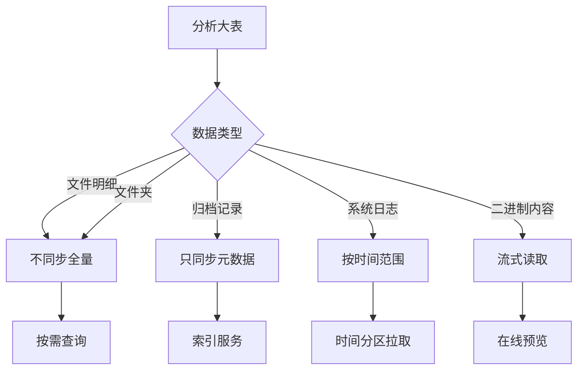
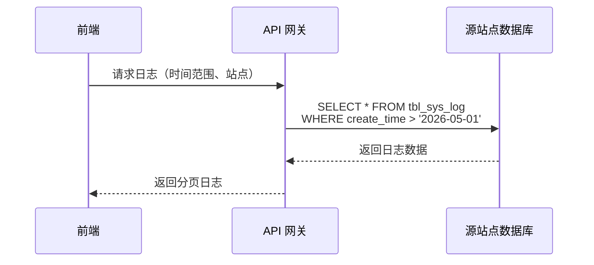

# 大表处理策略

> 文档版本: v1.0
> 更新时间: 2026-05-28

---

## 一、大表清单

### 1.1 识别的大表

| 表名 | 预估数据量 | 说明 |
|------|-----------|------|
| `tbl_file` | **千万~亿级** | 文件主表 |
| `tbl_folder` | **千万级** | 文件夹表 |
| `tbl_zip_file` | **千万级** | 压缩包文件表 |
| `tbl_file_path_archive` | **千万级** | 归档文件路径 |
| `tbl_check_files` | **百万~千万级** | 检测文件表 |
| `tbl_sys_log` | **百万~千万级** | 系统日志表 |

### 1.2 暂不同步原因

```
┌─────────────────────────────────────────────────────────────┐
│                     为什么暂不同步？                        │
├─────────────────────────────────────────────────────────────┤
│  1. 数据量过大                                             │
│     - 单站点 tbl_file 可能达千万条                         │
│     - 多站点合并后可达亿级                                 │
│     - 增量同步压力巨大                                     │
│                                                             │
│  2. 同步价值低                                             │
│     - 文件内容无需跨平台展示                               │
│     - 前端 Demo 只需统计数据                               │
│     - 明细数据按需查询即可                                 │
│                                                             │
│  3. 存储成本高                                             │
│     - 二进制数据占用大量空间                                │
│     - 增量同步带宽消耗大                                   │
│     - 存储成本线性增长                                     │
└─────────────────────────────────────────────────────────────┘
```

---

## 二、处理策略

### 2.1 分类处理



### 2.2 决策矩阵

| 表名 | 数据类型 | 处理策略 | 说明 |
|------|----------|----------|------|
| `tbl_file` | 文件明细 | **不同步全量** | 按需查询、索引导入 |
| `tbl_folder` | 文件夹 | **不同步全量** | 目录树按需加载 |
| `tbl_zip_file` | 压缩包 | **不同步全量** | 流式读取 |
| `tbl_file_path_archive` | 归档路径 | **不同步全量** | 按任务关联 |
| `tbl_check_files` | 检测文件 | **不同步全量** | 报告级同步 |
| `tbl_sys_log` | 日志 | **按时间范围** | 保留最近 30 天 |

---

## 三、文件级能力方案

### 3.1 能力矩阵

| 能力 | 方案 | 优先级 | 说明 |
|------|------|--------|------|
| 文件检索 | Elasticsearch 索引 | P2 | 建立文件索引，搜索即服务 |
| 文件导出 | 异步任务 + 分片导出 | P2 | 按需生成，不预同步 |
| 文件预览 | 流式读取，无存储 | P3 | 支持常见格式预览 |
| 批量操作 | 分页 + 异步任务 | P2 | 避免同步阻塞 |

### 3.2 P2 阶段：文件索引服务

**架构设计**

```
┌─────────────────────────────────────────────────────────────┐
│                    文件索引服务架构                         │
├─────────────────────────────────────────────────────────────┤
│                                                             │
│   源站点 DB ──→ [File Indexer] ──→ [Elasticsearch]        │
│                        │                                    │
│                        ▼                                    │
│                  [Search API]                               │
│                        │                                    │
│                        ▼                                    │
│                  [统一平台前端]                              │
│                                                             │
└─────────────────────────────────────────────────────────────┘
```

**索引字段**

```json
{
  "file_id": "long",
  "file_name": "text",
  "file_path": "text",
  "file_size": "long",
  "file_type": "keyword",
  "checksum": "keyword",
  "task_id": "long",
  "slot_id": "long",
  "source_site_id": "keyword",
  "create_dt": "date"
}
```

### 3.3 P2 阶段：异步导出任务

**导出流程**

```
用户发起导出
      │
      ▼
创建导出任务 ──→ 记录 tbl_export_task
      │
      ▼
后台处理（分片读取源站点文件）
      │
      ▼
生成导出文件（zip/光盘镜像）
      │
      ▼
通知用户下载
```

**导出任务表**

```sql
CREATE TABLE export_tasks (
    id SERIAL PRIMARY KEY,
    task_name VARCHAR(255),
    file_ids JSONB,              -- 要导出的文件ID列表
    export_format VARCHAR(50),    -- zip, iso, etc.
    status VARCHAR(20),           -- pending/processing/completed/failed
    progress INT DEFAULT 0,
    output_path VARCHAR(500),
    created_at TIMESTAMP,
    completed_at TIMESTAMP
);
```

---

## 四、日志处理方案

### 4.1 日志表不同步

`tbl_sys_log` 暂不同步，原因：
- 数据量大，增长快
- 历史价值低
- 按需查询即可

### 4.2 日志查询方案



### 4.3 日志保留策略

| 日志类型 | 源站点保留 | 统一平台 |
|----------|-----------|----------|
| 最近 7 天 | 完整保留 | 可实时查询 |
| 7-30 天 | 完整保留 | 按需查询 |
| 30 天以上 | 归档/删除 | 不保留 |

---

## 五、数据量估算

### 5.1 当前 P0 表数据量

| 表名 | 预估行数 | 同步建议 |
|------|---------|----------|
| `tbl_task` | 1-10 万 | 直接同步 |
| `tbl_disc_lib` | 100-1000 | 直接同步 |
| `tbl_slots` | 1-10 万 | 直接同步 |
| `tbl_early_warning` | 1-50 万 | 直接同步 |
| 其他 P0 表 | < 10 万 | 直接同步 |

### 5.2 大表数据量

| 表名 | 单站点量级 | 多站点量级 | 同步频率 |
|------|-----------|-----------|----------|
| `tbl_file` | 1000 万+ | 5000 万+ | 不同步 |
| `tbl_folder` | 500 万+ | 2500 万+ | 不同步 |
| `tbl_zip_file` | 100 万+ | 500 万+ | 不同步 |

### 5.3 存储成本对比

| 数据类型 | 单站点存储 | 多站点存储 | 同步成本 |
|----------|-----------|-----------|----------|
| P0 表 | ~100 MB | ~500 MB | 低 |
| 文件明细 | ~50 GB | ~250 GB | 高 |
| 日志 | ~10 GB | ~50 GB | 中 |

---

## 六、实施路线图

### 6.1 P0（当前阶段）

```
✓ 识别大表清单
✓ 确定不同步策略
○ 定义元数据同步范围
```

### 6.2 P1/P2（下一阶段）

```
□ 文件索引服务选型
□ 部署 Elasticsearch
□ 开发 File Indexer
□ 开发搜索 API
□ 实现异步导出功能
```

### 6.3 P3（未来阶段）

```
□ 流式预览服务
□ 分布式文件存储
□ CDN 加速
```

---

## 七、FAQ

### Q1: 用户需要查文件怎么办？

**A**: 按需查询。用户通过任务详情 → 文件列表发起查询，统一平台代理到源站点数据库获取结果。

### Q2: 如何保证文件可追溯？

**A**: P0 阶段同步任务元数据（包含文件数、文件总大小），文件详情通过 task_id 关联到源站点。

### Q3: 为什么日志也要处理？

**A**: 日志量大且价值低。前端 Demo 只需展示最近日志，无需全量同步。

### Q4: 大表什么时候同步？

**A**: P2 阶段引入文件索引服务后，按需索引、按需拉取。

---

## 八、备选方案

### 8.1 方案 B：定时拉取最近 N 天

如果未来需要简单实现：

```sql
-- 只同步最近 30 天的文件变更
SELECT * FROM tbl_file
WHERE update_dt > NOW() - INTERVAL '30 days'
ORDER BY id;
```

**限制**：
- 丢失历史数据
- 大表仍然同步量大

### 8.2 方案 C：分库分表同步

动态表名已按站点分库：

```
tbl_file_{siteId}
tbl_folder_{siteId}
```

按需同步指定站点的数据。

---

## 九、总结

| 策略 | 范围 | 理由 |
|------|------|------|
| 不同步全量文件明细 | P0 | 数据量太大，同步价值低 |
| 按需查询文件 | P1+ | 用户有需求时实时查询 |
| 文件索引服务 | P2 | 需要时再投入 |
| 日志按时间范围 | P0 | 保留最近 30 天 |
| 不同步历史归档 | - | 价值低，占用大 |