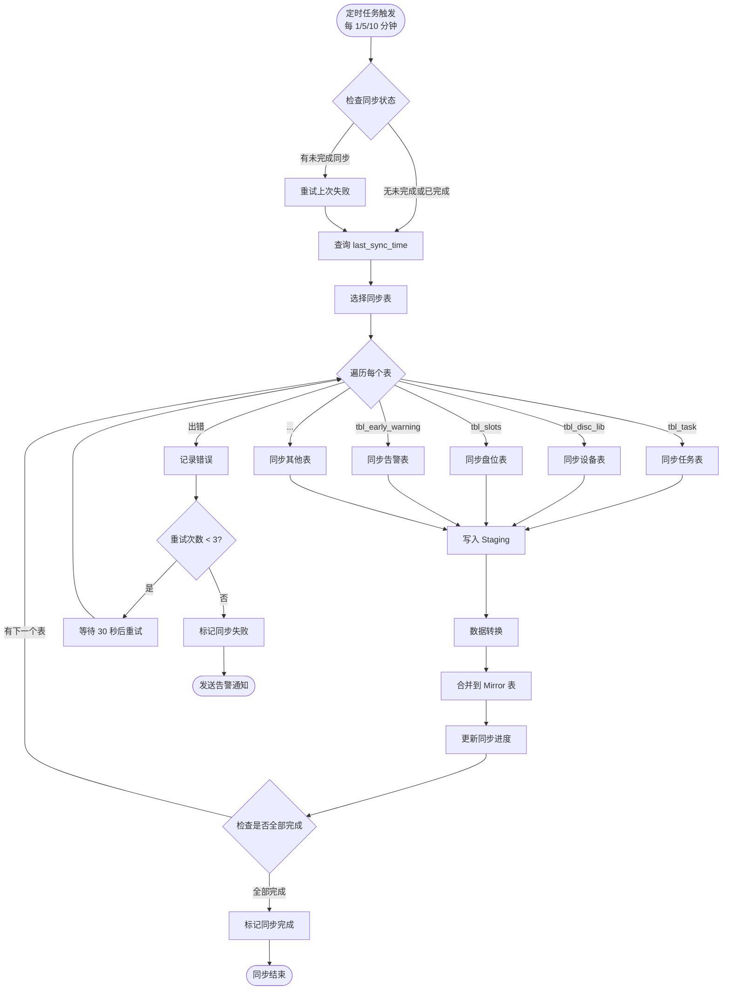
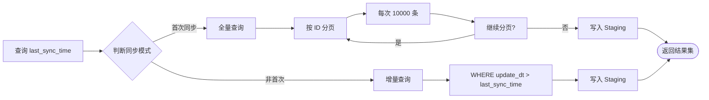
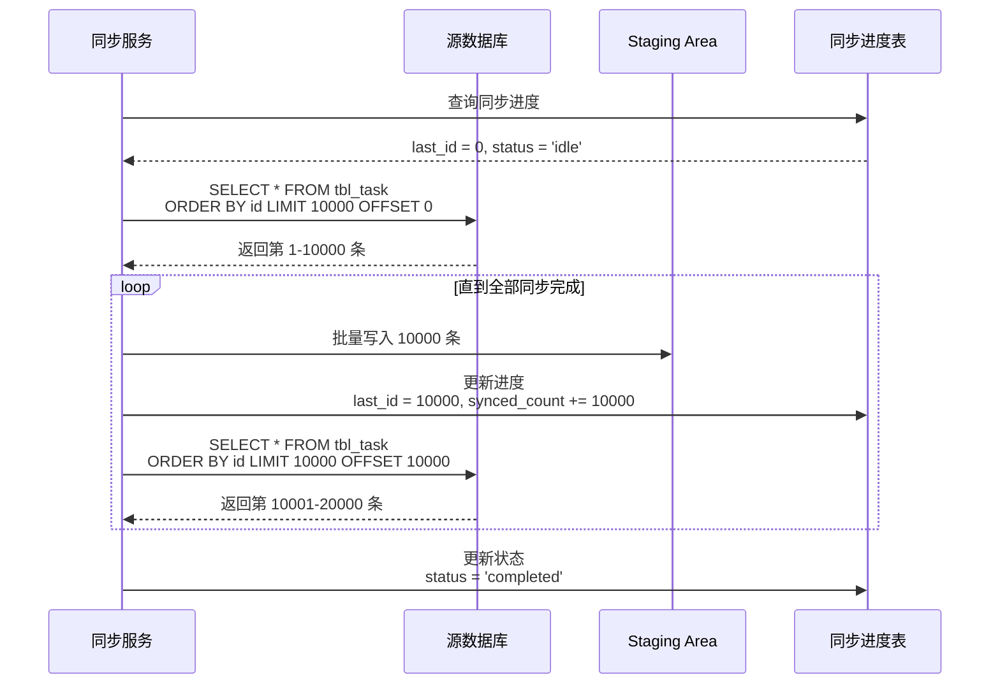
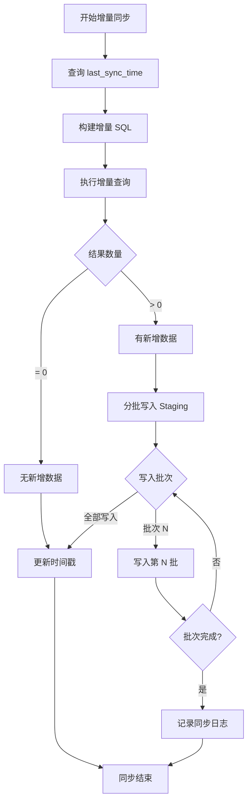
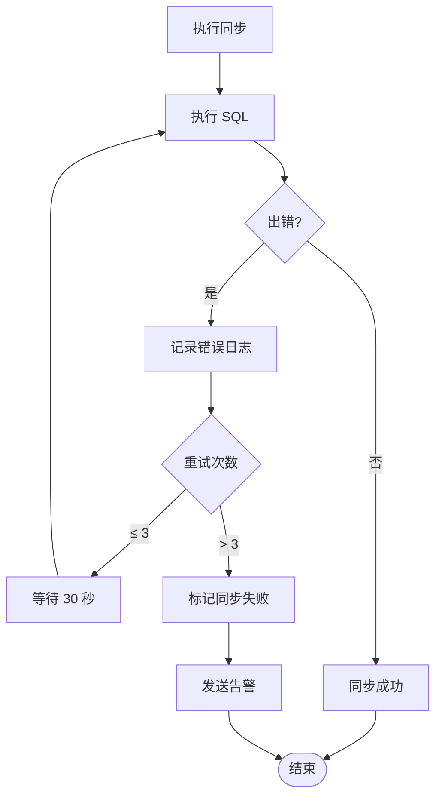

# 同步流程图

> 文档版本: v1.0
> 更新时间: 2026-05-28

---

## 一、整体同步流程

### 1.1 主流程



---

## 二、增量同步子流程

### 2.1 增量读取



---

## 三、首次同步（初始化）

### 3.1 分页初始化



### 3.2 初始化注意事项

| 注意事项 | 说明 |
|----------|------|
| 分页大小 | 每次 10000 条，避免内存溢出 |
| 排序字段 | 必须有主键或索引字段，确保分页正确 |
| 断点续传 | 记录 last_id，失败后从断点继续 |
| 速度控制 | 限制并发，避免影响源数据库 |

---

## 四、增量同步子流程

### 4.1 增量同步



### 4.2 增量 SQL 示例

```sql
-- 任务表增量同步
SELECT
    id,
    uuid,
    task_type,
    task_name,
    status,
    burn_status,
    total_files,
    total_size,
    create_dt,
    update_dt
FROM tbl_task
WHERE update_dt > '{{last_sync_time}}'
ORDER BY id;

-- 设备表快照同步
SELECT
    lib_id,
    name,
    device_status,
    type,
    IP,
    mags,
    slots,
    group_id,
    use_status
FROM tbl_disc_lib
ORDER BY lib_id;

-- 告警表增量同步（真实字段以 schema-inventory 为准）
SELECT
    id,
    title,
    type,
    status,
    s_level,
    create_date,
    lib_id,
    user_id
FROM tbl_early_warning
WHERE create_date > '{{last_sync_time}}'
   OR id > '{{last_sync_id}}';
```

说明：设备、盘位、盘笼、光驱等源表缺少可靠更新时间字段，一期按快照同步并通过 `source_hash` 判断是否更新。

---

## 五、错误处理流程

### 5.1 错误重试机制



### 5.2 错误日志表

```sql
CREATE TABLE sync_errors (
    id SERIAL PRIMARY KEY,
    table_name VARCHAR(100) NOT NULL,
    source_site_id VARCHAR(50),
    error_type VARCHAR(50),
    error_message TEXT,
    sql_statement TEXT,
    retry_count INT DEFAULT 0,
    status VARCHAR(20) DEFAULT 'pending',  -- pending/retrying/resolved/ignored
    created_at TIMESTAMP DEFAULT CURRENT_TIMESTAMP,
    resolved_at TIMESTAMP
);
```

---

## 六、同步时间戳管理

### 6.1 时间戳追踪

```sql
-- 同步进度表
CREATE TABLE sync_progress (
    id SERIAL PRIMARY KEY,
    table_name VARCHAR(100) NOT NULL,
    source_site_id VARCHAR(50),

    -- 增量同步时间戳
    last_sync_time TIMESTAMP,

    -- 分页同步进度
    last_sync_id BIGINT DEFAULT 0,
    total_count BIGINT DEFAULT 0,
    synced_count BIGINT DEFAULT 0,

    -- 状态
    status VARCHAR(20) DEFAULT 'idle',  -- idle/syncing/completed/failed
    error_msg TEXT,
    retry_count INT DEFAULT 0,

    -- 时间戳
    created_at TIMESTAMP DEFAULT CURRENT_TIMESTAMP,
    updated_at TIMESTAMP DEFAULT CURRENT_TIMESTAMP,
    completed_at TIMESTAMP,

    UNIQUE(table_name, source_site_id)
);
```

### 6.2 更新时间戳逻辑

```sql
-- 伪代码
function updateSyncTime(tableName, sourceSiteId, newSyncTime):
    UPDATE sync_progress
    SET
        last_sync_time = newSyncTime,
        updated_at = NOW(),
        status = 'idle'
    WHERE table_name = tableName
      AND source_site_id = sourceSiteId;
```
