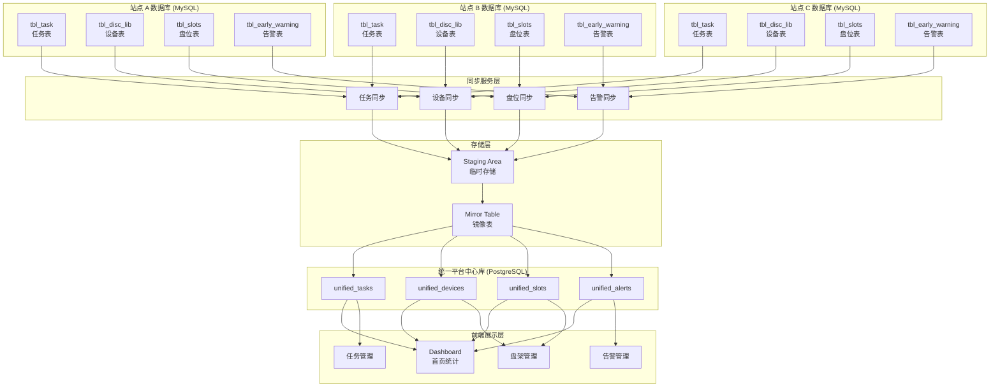
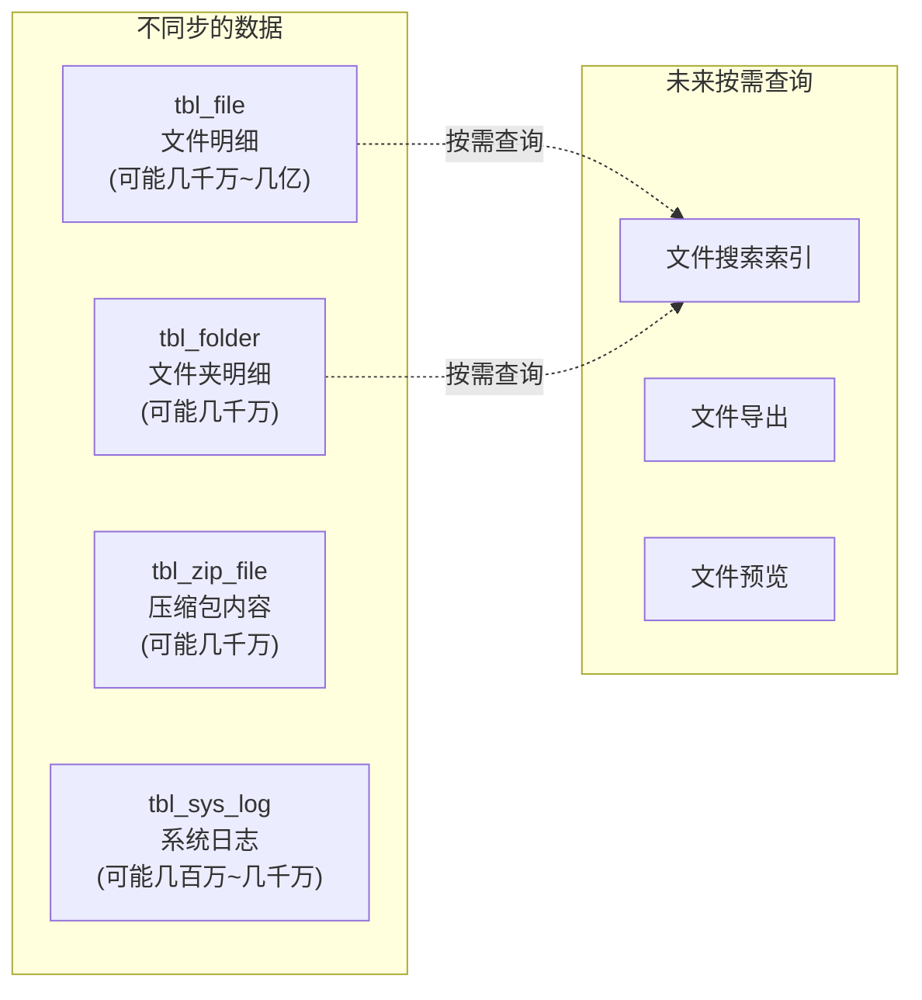

# 系统总体架构图

> 文档版本: v1.0
> 更新时间: 2026-05-28

---

## 一、系统架构总览

### 1.1 多站点数据采集架构



---

### 1.2 数据流向说明

| 层级 | 说明 | 同步方式 |
|------|------|----------|
| **站点数据库** | 各站点 MySQL 数据库，包含全部原始数据 | - |
| **同步服务** | 定时任务，增量读取站点数据 | 每 5 分钟 |
| **Staging Area** | 临时存储，接收原始数据 | 写入后处理 |
| **Mirror Table** | 镜像表，最终合并数据 | 处理后合并 |
| **统一中心库** | 合并后的统一数据 | 展示使用 |
| **前端页面** | Dashboard / 任务 / 盘架 / 告警 | 实时读取 |

---

## 二、不同步的数据

### 2.1 不同步的文件级数据



### 2.2 不同步原因

| 数据类型 | 原因 | 处理方式 |
|----------|------|----------|
| 文件明细 | 单站点可达千万，多站点可达亿级 | 按需查询、搜索索引 |
| 文件夹明细 | 目录树结构，变化少 | 按需同步根目录 |
| 压缩包内容 | 二进制数据，体积大 | 流式读取，不存储 |
| 系统日志 | 量大，价值低 | 按时间范围拉取 |

---

## 三、统一平台定位

### 3.1 统一平台不是

- ❌ **不是**文件存储系统
- ❌ **不是**文件检索系统
- ❌ **不是**文件备份系统
- ❌ **不是**全量数据同步平台

### 3.2 统一平台是

- ✅ **是**多站点任务汇总平台
- ✅ **是**多站点设备监控平台
- ✅ **是**多站点告警汇聚平台
- ✅ **是**多站点容量统计平台
- ✅ **是**统一管理入口

### 3.3 架构原则

```
┌─────────────────────────────────────────────────────────────┐
│                    统一平台核心定位                        │
├─────────────────────────────────────────────────────────────┤
│  1. 只同步元数据，不同步文件内容                            │
│  2. 只同步统计数据，不同步明细流水                         │
│  3. 保留站点来源，支持数据溯源                            │
│  4. 实时性要求高的数据优先同步（告警、任务状态）            │
│  5. 静态数据定时同步（用户、配置、字典）                   │
└─────────────────────────────────────────────────────────────┘
```

---

## 四、技术栈

| 层级 | 技术选型 | 说明 |
|------|----------|------|
| 统一中心库 | PostgreSQL 17 | 关系型数据库 |
| 同步服务 | Node.js / Python | 定时任务脚本 |
| 前端框架 | Next.js 16 | React 19 |
| 前端样式 | Tailwind CSS v4 | - |
| 组件库 | Radix UI | - |
| 图表 | Recharts | - |
